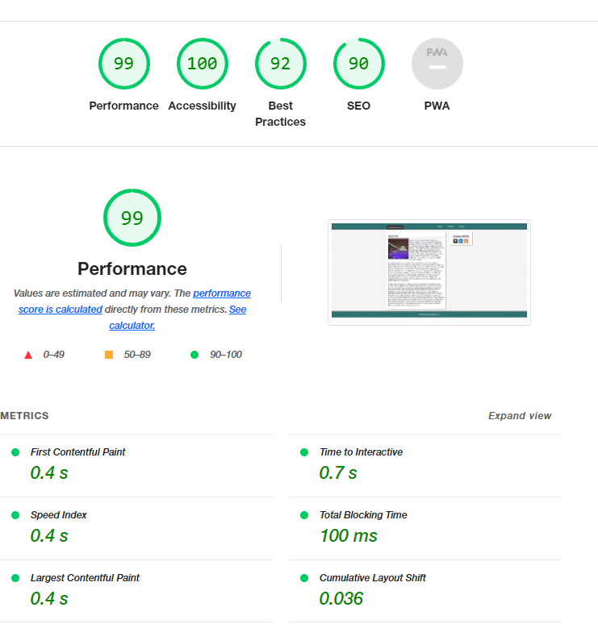

# m5-hw-christensen-kristine
Assignment 5: Create a Portfolio Webpage using HTML & CSS Float Layouts
## About This Assignment ##
For this assignment, we were to create a page modeled off the mockup provided.

## Lighthouse Report ##
